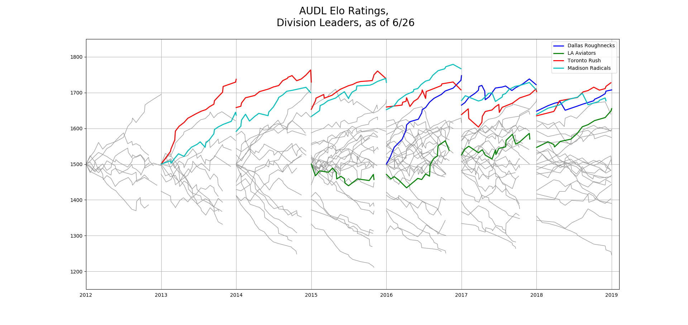

## AUDL Elo Ratings
This repo contains code used to apply an Elo rating model to the AUDL. The data is scraped from various places, either theaudl.com or saved webpages containing game information from previous seasons. The Elo data file is in the format of [FiveThirtyEight's NBA Elo](https://github.com/fivethirtyeight/data/tree/master/nba-elo) data.

Inspired by FiveThrityEight's NBA Elo ratings. I apply an Elo ranking to the American Ultimate Disc League (AUDL). The AUDL started playing games in 2012 and is now a 23 team, 4 division professional ultimate league.

### Visualization
With the tools.one_plot() function, I create a chart of historical Elo data for every team in the AUDL with specific teams highlighted.

