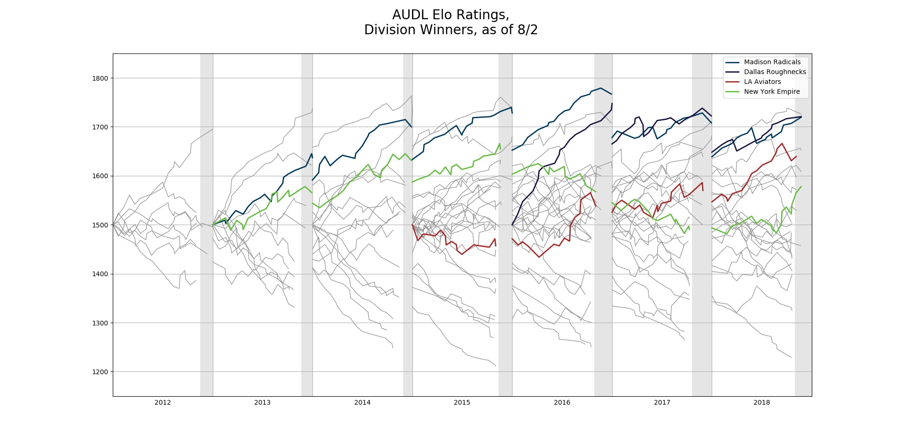
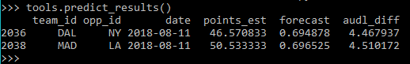

## AUDL Elo Ratings
This repo contains code used to apply an Elo rating model to the AUDL. The data is scraped from various places, either [the AUDL website](https://theaudl.com) or saved webpages containing game information from previous seasons. The Elo data file is in the format of [FiveThirtyEight's NBA Elo](https://github.com/fivethirtyeight/data/tree/master/nba-elo) data.

Inspired by FiveThrityEight's NBA Elo ratings. I apply an Elo ranking to the American Ultimate Disc League (AUDL). The AUDL started playing games in 2012 and is now a 23 team, 4 division professional ultimate league.

### Visualization
With the tools.one_plot function, I create a chart of historical Elo data for every team in the AUDL with specific teams highlighted.

### Prediction
The tools.predict_results function produces a prediction for any future gamse that have been scraped. This includes a game forecast in the format of a percentage chance the team under 'team_id' wins and a predicted point differential under audl_diff. There is also a naive prediction of the total number of points scored in the game.

I utilized this tool during the regular season to test this models predictions against a game called [AUDL Pick'Em](https://audlpicks.com) run by the AUDL. The model's predictions took second in the 2018 competition and would have took first had I known about the game before the third week of competition was over.

## Setup

### Download the data
  * Most up to date information is collected in [audl_elo.csv](audl_elo.csv)

### Install the requirements
  * Use `pip install -r requirements.txt`
    * You may want to use a virtual environment for this.

## Usage

### Reproduce the data
  * Clone this repo to your computer.
  * Change directory into each of the year folders, 2012 through 2018.
    * Run `python scraper_(year).py` in each folder to produce the (year)_audl_games.csv file in the given folder.
  * Navigate back to the main directory.
  * Run `python audl_elo.py` to create the data set in audl_elo.csv.
